# 航天电子 数据探索报告（2026-06-08）

> 生成:2026-06-09 | 数据:2024-06-11~2026-06-08(483日) | 来源:baostock(前复权)

---

## 1. 公司基本信息

| 项目 | 值 |
|------|-----|
| 代码/名称 | `sh.600879` / **航天电子** |
| 上市 | 1995-11-15（约31年） |
| 行业 | C37铁路、船舶、航空航天和其他运输设备制造业 |
| 类型/状态 | 股票 / 正常上市 |

---

## 2. 数据概览

共483个交易日。字段: open开盘/high最高/low最低/close收盘(前复权)/volume成交量/amount成交额/turn换手率%/pctChg涨跌幅%/peTTM市盈率/pbMRQ市净率/psTTM市销率/pcfNcfTTM市现率。

---

## 3. 估值指标

- **PE(TTM)**=股价÷近12月EPS。越高→高估或高增长预期。当前317.2(高位，82%分位)
- **PB(MRQ)**=股价÷每股净资产。<1→破净。当前3.47(高位，84%分位)
- **PS(TTM)**=总市值÷近12月营收。当前5.16
- **PCF**=股价÷每股经营现金流。为负→经营现金流为负。当前-73.5，经营现金流为负

---

## 4. 最新行情(2026-06-08)

| 收盘价 | 涨跌幅 | 换手率 | 成交量 | 成交额 |
|--------|--------|--------|--------|--------|
| **21.97**元 | +2.00% | 7.43% | 24501万股 | 53.32亿 |

> 近2年从7.03到21.97(+183.4%)，最高31.56(2026-01-12)，当前较高点回撤30%

---

## 5. 统计摘要

|       |   open |   high |    low |   close |        volume |   turn |   pctChg |   peTTM |   pbMRQ |   psTTM |   pcfNcfTTM |
|:------|-------:|-------:|-------:|--------:|--------------:|-------:|---------:|--------:|--------:|--------:|------------:|
| count | 483    | 483    | 483    |  483    | 483           | 483    |   483    |  483    |  483    |  483    |      483    |
| mean  |  12.62 |  12.94 |  12.37 |   12.66 |   1.24887e+08 |   3.8  |     0.26 |  144.7  |    2.02 |    2.98 |     -206.05 |
| std   |   6.29 |   6.57 |   6.1  |    6.33 |   1.44966e+08 |   4.39 |     3.12 |  135.54 |    1    |    1.56 |      679.67 |
| min   |   7.01 |   7.1  |   6.85 |    7.03 |   1.50414e+07 |   0.47 |   -10.01 |   47.38 |    1.14 |    1.3  |    -2209.83 |
| 25%   |   8.57 |   8.76 |   8.46 |    8.62 |   4.15721e+07 |   1.28 |    -1.47 |   54.09 |    1.38 |    1.96 |      -69.83 |
| 50%   |   9.77 |   9.92 |   9.66 |    9.78 |   6.74492e+07 |   2.06 |     0.13 |   71.81 |    1.57 |    2.48 |      -52.79 |
| 75%   |  12    |  12.32 |  11.66 |   12.16 |   1.41511e+08 |   4.3  |     1.68 |  201.81 |    1.93 |    3.17 |       58.74 |
| max   |  32.23 |  32.24 |  30    |   31.56 |   8.30718e+08 |  25.18 |    10.02 |  532.99 |    5.02 |    7.5  |      695.83 |

---

## 6. 图表

### 6.1 价格走势
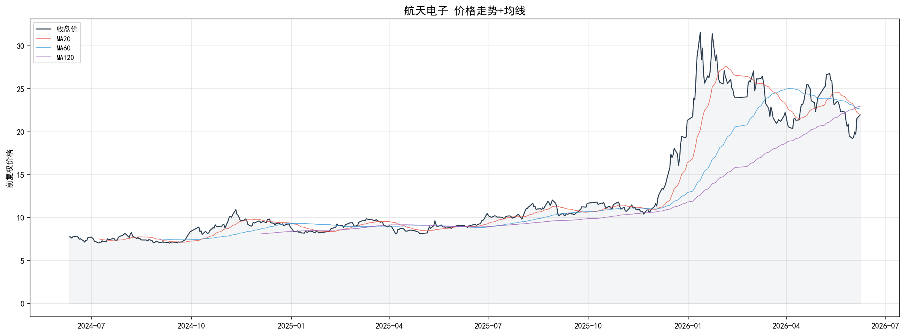
> 当前在MA20下方，空头排列

### 6.2 成交量+换手率
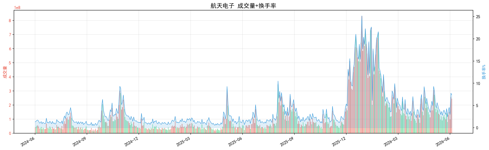

### 6.3 市盈率PE
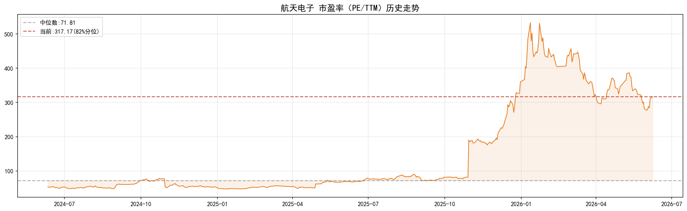
> PE波动47~533，当前317.2(82%分位)，仅18%时间更贵

### 6.4 市净率PB
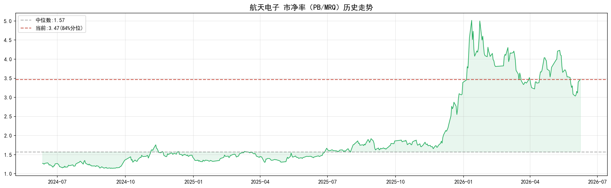
> PB波动1.14~5.02，当前3.47(84%分位)

### 6.5 市现率PCF
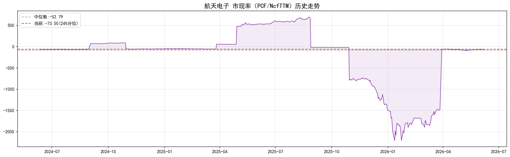
> 当前-73.5，经营现金流为负，主营业务造血能力不足

### 6.6 估值全景
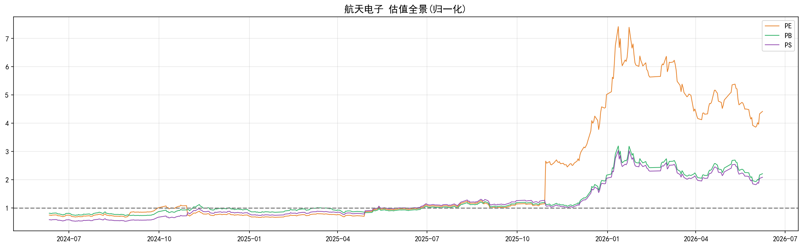
> PE/PB/PS归一化至各自中位数=1，三指标均高于中位数，估值全面偏贵

### 6.7 指标分布
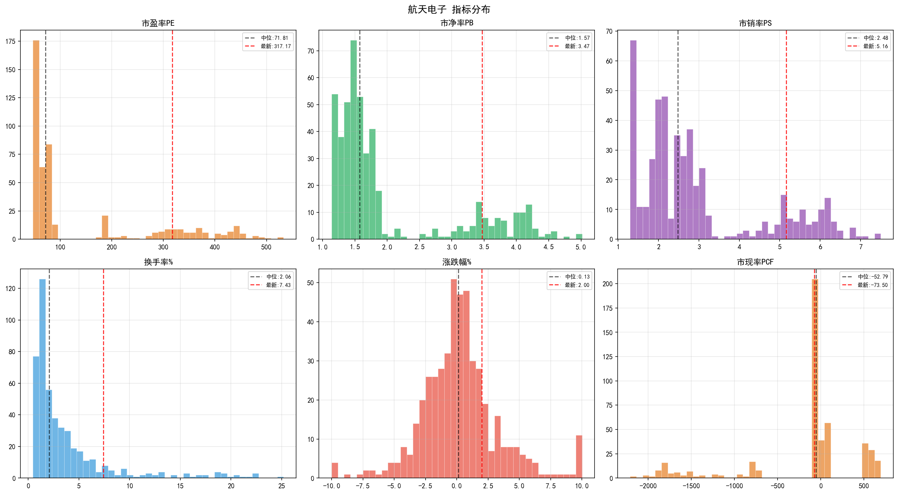

---

## 7. 季度财务数据（3年×6报告期）

以下展示2024-2026年每个报告期（Q1/Q2单季/半年报/Q3/Q4单季/年报）的核心财务指标。累计类指标（营收、净利润）已拆分为单季数据；比率类指标（毛利率、ROE等）展示当期值。

### 7.1 营业收入
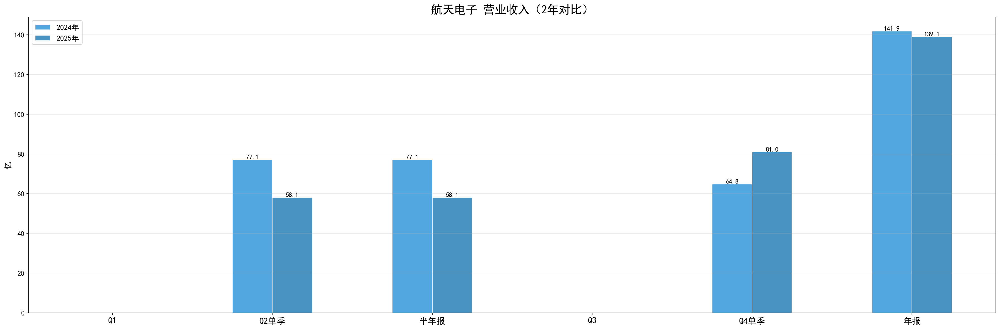

### 7.2 净利润
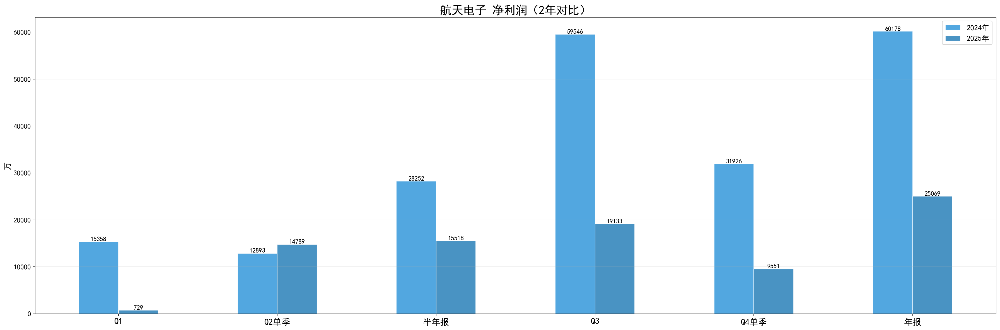

### 7.3 毛利率
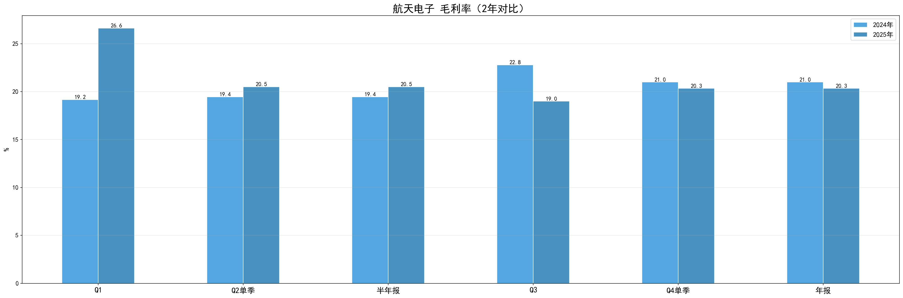

### 7.4 净利率
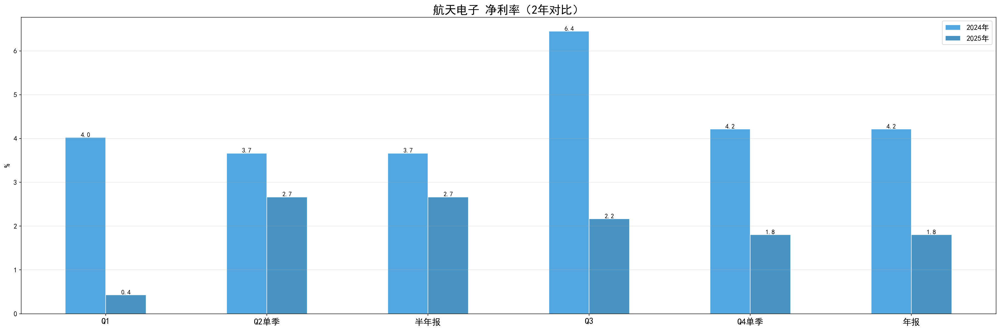

### 7.5 ROE
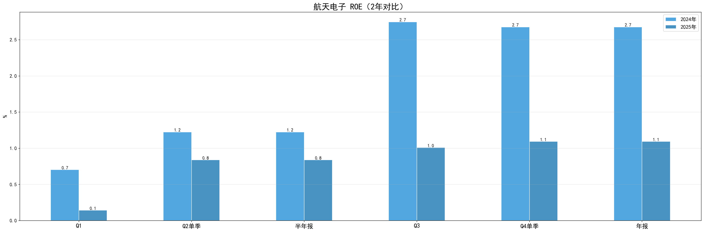

### 7.6 资产负债率
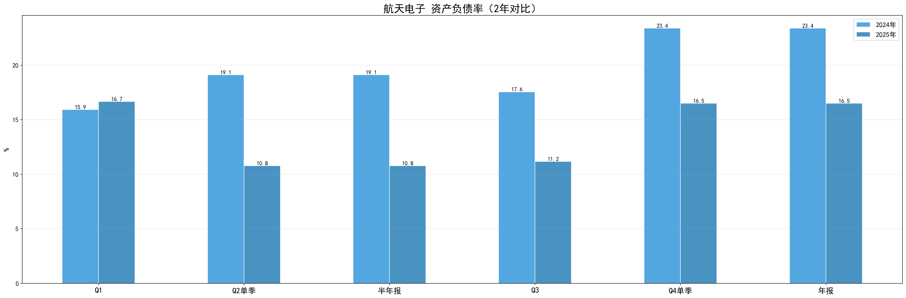

---

## 8. 总结

| 维度 | 状态 |
|------|------|
| 价格 | 7.03→21.97(+183.4%)，最高31.56 |
| PE | 317.2(中位71.8)，高位 |
| PB | 3.47(中位1.57)，高位 |
| 现金流 | 经营现金流为负 |
| 2025年报 | 营收139.1亿，净利25069万 |

> 本报告由`scripts/explore_stock.py`自动生成，仅做数据展示，不构成投资建议。
