# 麦格米特 数据探索报告（2026-06-08）

> 生成:2026-06-09 | 数据:2024-06-11~2026-06-08(483日) | 来源:baostock(前复权)

---

## 1. 公司基本信息

| 项目 | 值 |
|------|-----|
| 代码/名称 | `sz.002851` / **麦格米特** |
| 上市 | 2017-03-06（约9年） |
| 行业 | C38电气机械和器材制造业 |
| 类型/状态 | 股票 / 正常上市 |

---

## 2. 数据概览

共483个交易日。字段: open开盘/high最高/low最低/close收盘(前复权)/volume成交量/amount成交额/turn换手率%/pctChg涨跌幅%/peTTM市盈率/pbMRQ市净率/psTTM市销率/pcfNcfTTM市现率。

---

## 3. 估值指标

- **PE(TTM)**=股价÷近12月EPS。越高→高估或高增长预期。当前565.7(高位，99%分位)
- **PB(MRQ)**=股价÷每股净资产。<1→破净。当前9.66(高位，89%分位)
- **PS(TTM)**=总市值÷近12月营收。当前8.78
- **PCF**=股价÷每股经营现金流。为负→经营现金流为负。当前934.7

---

## 4. 最新行情(2026-06-08)

| 收盘价 | 涨跌幅 | 换手率 | 成交量 | 成交额 |
|--------|--------|--------|--------|--------|
| **149.00**元 | +1.71% | 9.63% | 4410万股 | 65.96亿 |

> 近2年从21.77到149.00(+438.0%)，最高157.98(2026-06-03)，当前较高点回撤6%

---

## 5. 统计摘要

|       |   open |   high |    low |   close |        volume |   turn |   pctChg |   peTTM |   pbMRQ |   psTTM |   pcfNcfTTM |
|:------|-------:|-------:|-------:|--------:|--------------:|-------:|---------:|--------:|--------:|--------:|------------:|
| count | 483    | 483    | 483    |  483    | 483           | 483    |   483    |  483    |  483    |  483    |      483    |
| mean  |  65.62 |  67.64 |  63.96 |   65.78 |   2.59317e+07 |   5.77 |     0.44 |  126.78 |    6.25 |    4.22 |       98.38 |
| std   |  31.9  |  33.04 |  30.9  |   31.99 |   1.56699e+07 |   3.53 |     4.2  |  123.25 |    2.44 |    1.89 |      212.04 |
| min   |  21.76 |  22.03 |  21.68 |   21.77 |   1.74901e+06 |   0.42 |   -10    |   18.07 |    2.51 |    1.5  |     -196.32 |
| 25%   |  44.35 |  45.53 |  43.34 |   44.59 |   1.48396e+07 |   3.29 |    -2.22 |   42.15 |    4.27 |    2.91 |       17.03 |
| 50%   |  59.94 |  61.73 |  58.04 |   59.96 |   2.22443e+07 |   4.9  |     0.14 |   65.49 |    6.3  |    4.15 |       37.66 |
| 75%   |  81.88 |  84.92 |  80    |   82.57 |   3.45084e+07 |   7.58 |     2.92 |  181.31 |    7.82 |    5.07 |      150.06 |
| max   | 155.01 | 162.75 | 152.9  |  157.98 |   1.08261e+08 |  26.04 |    10.01 |  599.84 |   12.27 |    9.31 |      991.06 |

---

## 6. 图表

### 6.1 价格走势
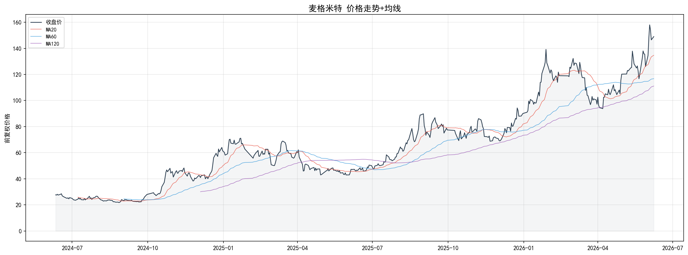
> 当前在MA20上方，多头排列

### 6.2 成交量+换手率
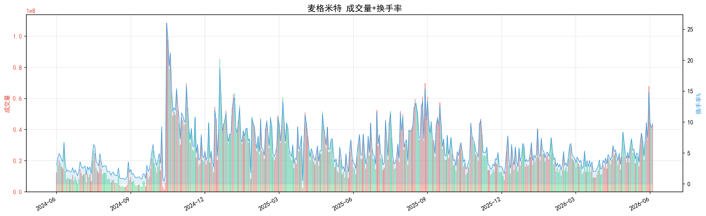

### 6.3 市盈率PE
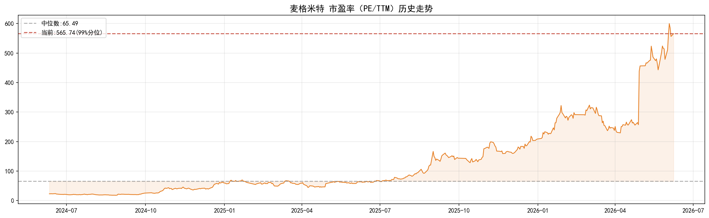
> PE波动18~600，当前565.7(99%分位)，仅1%时间更贵

### 6.4 市净率PB
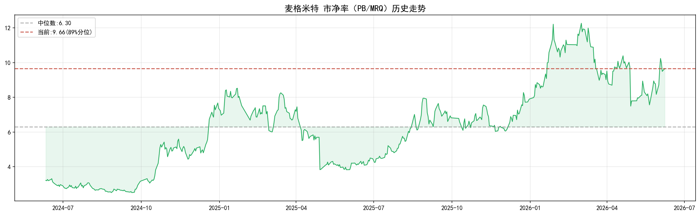
> PB波动2.51~12.27，当前9.66(89%分位)

### 6.5 市现率PCF
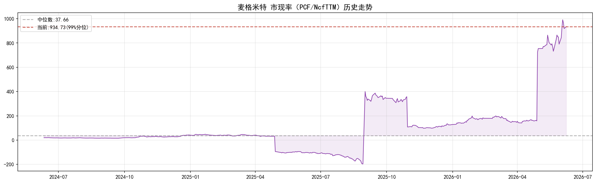
> 当前934.7

### 6.6 估值全景
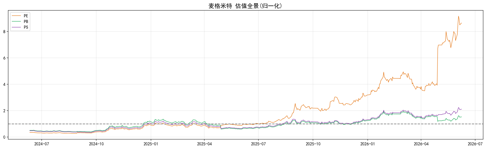
> PE/PB/PS归一化至各自中位数=1，三指标均高于中位数，估值全面偏贵

### 6.7 指标分布
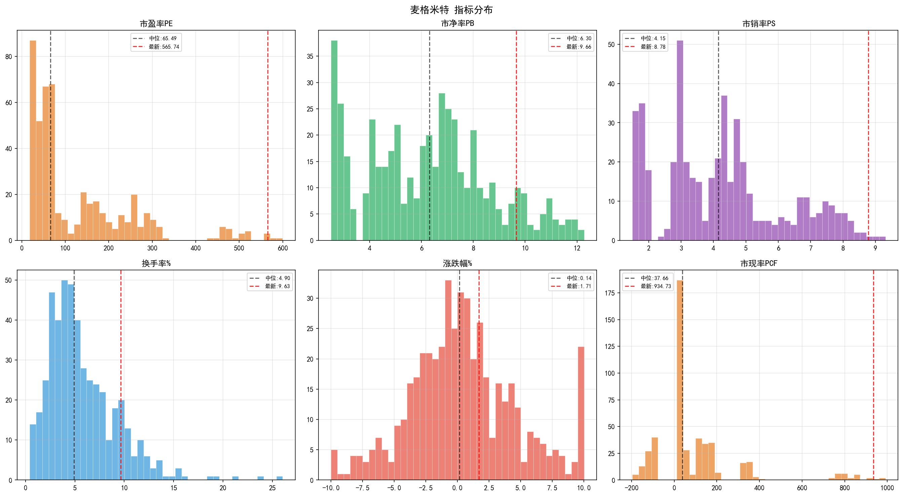

---

## 7. 季度财务数据（3年×6报告期）

以下展示2024-2026年每个报告期（Q1/Q2单季/半年报/Q3/Q4单季/年报）的核心财务指标。累计类指标（营收、净利润）已拆分为单季数据；比率类指标（毛利率、ROE等）展示当期值。

### 7.1 营业收入
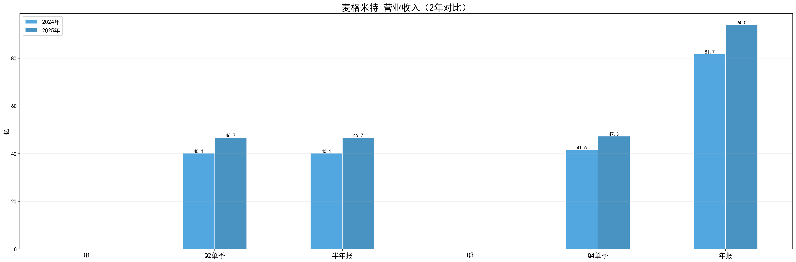

### 7.2 净利润
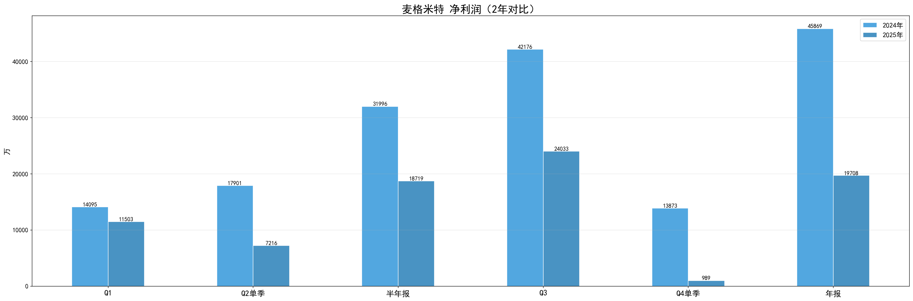

### 7.3 毛利率
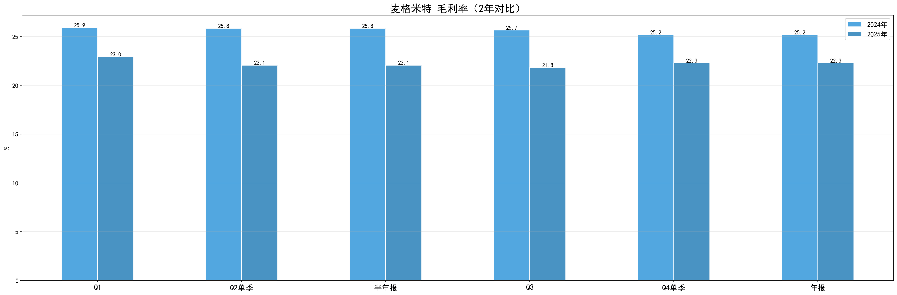

### 7.4 净利率
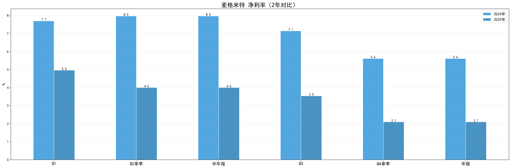

### 7.5 ROE
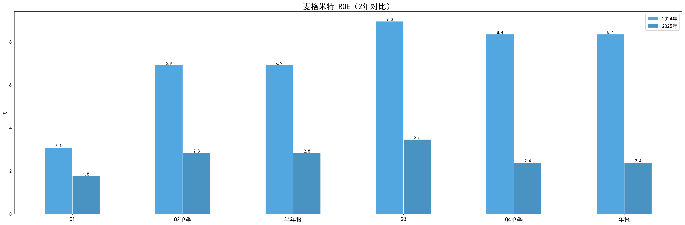

### 7.6 资产负债率
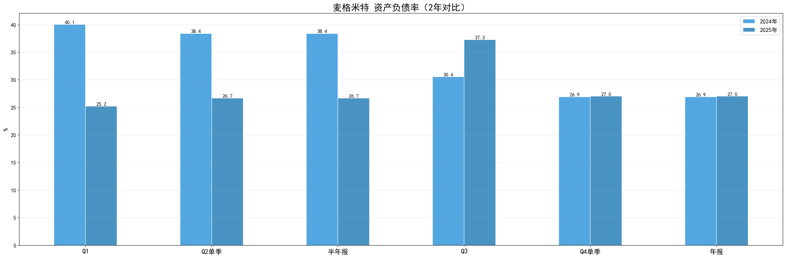

---

## 8. 总结

| 维度 | 状态 |
|------|------|
| 价格 | 21.77→149.00(+438.0%)，最高157.98 |
| PE | 565.7(中位65.5)，高位 |
| PB | 9.66(中位6.30)，高位 |
| 现金流 | 现金流为正 |
| 2025年报 | 营收94.0亿，净利19708万 |

> 本报告由`scripts/explore_stock.py`自动生成，仅做数据展示，不构成投资建议。
